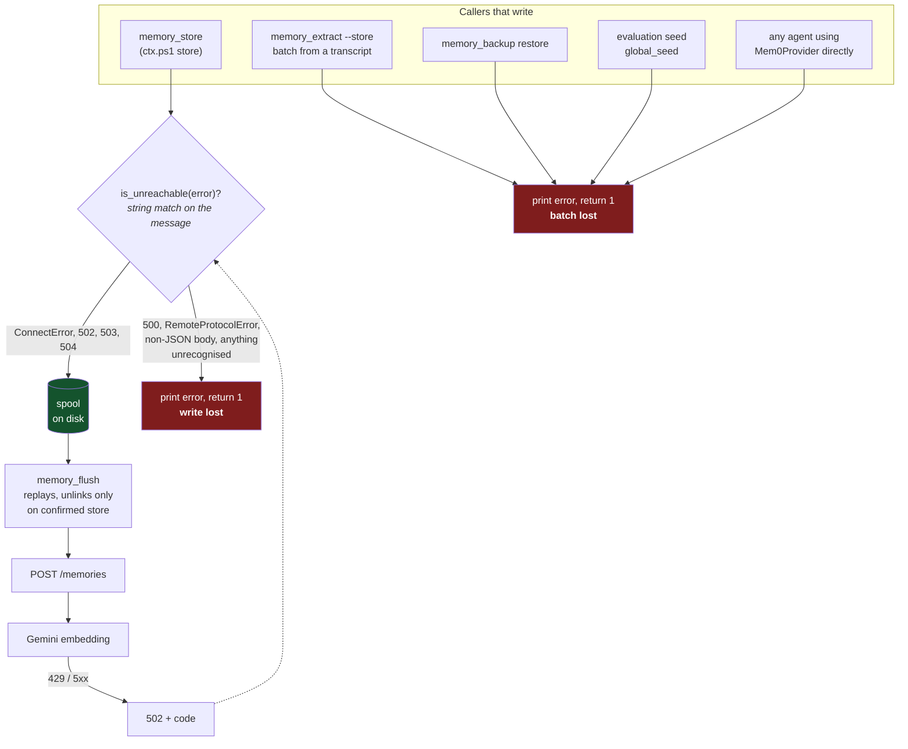
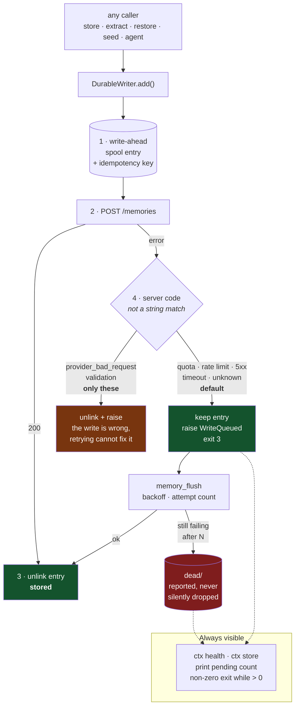

# Not losing a write

*Status: proposal. Nothing here is implemented yet — the "Today" section is
measured against the running stack on 2026-09-13, the rest is design.*

Reads and writes are not worth the same. A search that fails is retried by the
person who ran it, one second later, at no cost. A write that fails takes an
observation with it — the reason someone made a decision, the failure they just
diagnosed — and nobody notices, because the thing that was lost never existed
anywhere else. **Losing a query is an inconvenience. Losing a write is the
product failing at its one job.**

So the asymmetry is deliberate: reads may fail fast, writes may not fail at all.

## Today: what actually happens

Measured, not assumed. Against the live stack with the Gemini daily quota
genuinely exhausted:

```
$ python -m src.scripts.memory_store --scope task --key quota-probe ...
WARNING: the Mem0 server is unreachable. The memory was NOT stored.
  reason:  Mem0 POST /memories failed [502]: Provider quota exhausted for the day: ...
  queued:  ...\spool\20260913T181133-8fe5d539.json
  pending: 1 write(s) waiting
exit 3
```

So the CLI does queue a quota failure. It does **not** stack up silently, and it
does not throw-and-forget. `memory_flush` then replays, and `Spool.flush` only
calls `path.unlink()` after `provider.add` returns — a failed replay keeps the
file.

That is the good half. The bad half is that this holds for exactly one caller
and one hand-written list of error strings.



Three holes, in order of how much they cost:

1. **The safety net is in the wrong layer.** `Spool` is imported by
   `memory_store.py` and `memory_flush.py` and nothing else. `memory_extract
   --store` writes a whole batch of extracted candidates and, on any failure,
   prints and returns 1 — that is the single largest loss in the system, because
   it is many memories at once and they came from a transcript that may be gone.
   Same for `memory_backup restore`, both seeders, and any agent that constructs
   a `Mem0Provider` itself.

2. **The decision is a string match, and it defaults to losing.**

   ```python
   markers = ("Connection refused", "10061", "Max retries",
              "Failed to establish", "[502]", "[503]", "[504]")
   ```

   A 500 is not in that list. Neither is `httpx.RemoteProtocolError`,
   `httpx.PoolTimeout`, a proxy's HTML error page (which trips the "non-JSON
   body" branch), or a 429 if the server ever stopped wrapping it as a 502. Each
   one is a real embedding failure and each one currently loses the write. The
   default answer to "should this be kept?" is **no**, which is the wrong way
   round: the cost of wrongly queueing is a file a human deletes, and the cost
   of wrongly discarding is an observation nobody can recover.

3. **The client throws away what the server told it.** `errors.py` already
   returns a typed `code` (`provider_quota_exhausted`, `provider_rate_limited`,
   `provider_unavailable`, `provider_bad_request`, …) in the response body.
   `Mem0Provider._request` formats a string and drops the code, so the client
   re-derives intent by grepping the string it just built. That is also why the
   warning above says *"the Mem0 server is unreachable — start the stack"* when
   the server is up and the truth is a spent quota.

There is a fourth, structural: the `memories.vector` column is **nullable**
(`vector | vector(768) | | |`). Nothing at the storage layer prevents a row that
was accepted but never embedded — invisible to every search, indistinguishable
from not existing. No such row exists today (0 of 16), but the guarantee is not
enforced, it is merely holding.

## Proposed

One rule: **the durability boundary moves from the CLI to the provider, and its
default flips to keep.**



What each numbered step buys:

**1 — write ahead, not write behind.** The entry hits disk *before* the request,
so a crash, a `Ctrl+C`, or a killed terminal mid-POST leaves the memory
recoverable. Today the spool is only written in the exception handler, so a
process that dies during the call loses the write with no error at all.

The cost is a new duplicate window: stored server-side, then killed before
`unlink`, and the flush replays it. Paid for with an idempotency key — mem0
already stores a `hash` per memory, so the replay can be made a no-op on an
existing hash. Duplicating a memory is recoverable; losing one is not, so this
trade goes in the right direction.

**4 — an allowlist of failures worth dropping, not an allowlist of failures
worth keeping.** Only a request the server judged *malformed* fails fast,
because that one genuinely cannot succeed on retry. Everything else — including
an error nobody has seen before — is kept. This is the whole inversion: an
unrecognised error must land on the safe side of the default.

The classification comes from the server's `code` field, which already exists
and is already correct. The client stops parsing its own error message.

**The drain needs a floor.** A queue that only grows is a slow leak with extra
steps. `memory_flush` gets backoff and an attempt counter; a write that fails N
times moves to `dead/` and is *reported*, never quietly discarded — a human
decides. And the pending count belongs in `ctx health` and in the tail of every
`ctx store`, with a non-zero exit while anything is queued, so "queued" cannot
be mistaken for "stored" by a script or by a person skimming.

## The three ways to do it

| | Where durability lives | Covers | Cost |
|---|---|---|---|
| **A. Widen the predicate** | `memory_store.py`, as today | The CLI only | Hours. One function, invert its default. |
| **B. Provider-level write-ahead** *(recommended)* | `Mem0Provider` / `DurableWriter` | Every Python caller | A day or two. Touches one class; callers unchanged. |
| **C. Server-side ingest queue** | `POST /memories` accepts, embeds async | Every client, including the dashboard and a future MCP server | Largest. A worker, a job table, and a real fork of upstream's write path. |

**A** is a genuine improvement and is most of the safety for a fraction of the
work — but it leaves `memory_extract --store` losing whole batches, which is the
single worst case in the system. It fixes the predicate and not the layering.

**C** is the only option that also protects a write issued by the dashboard or
by an MCP client that is not Python. But it makes the accepted-but-unembedded
row a normal state rather than an anomaly, which means search results are
silently incomplete for as long as the backlog exists — and the nullable
`vector` column means nothing would catch it. That needs a `pending_embedding`
flag and a way for search to report "N rows not yet searchable" before C is safe
to build. Real, but not first.

**B is the recommendation.** It puts the guarantee at the narrowest point every
Python write already passes through, so `extract`, `restore`, the seeders and any
agent holding a provider all inherit it without changing a line. It subsumes A —
the inverted predicate is part of it — and it does not block C later, because a
server-side queue would sit behind the same provider call.

Suggested order, each independently useful:

1. Provider surfaces the server's `code` as a typed exception. *(Small, and
   immediately fixes the "server is unreachable / start the stack" message that
   is wrong for a quota.)*
2. Invert the predicate: keep by default, drop only on an explicit permanent
   set.
3. Move enqueue into `DurableWriter.add`, write-ahead, with the hash as the
   idempotency key.
4. Flush gets backoff, attempt counts and `dead/`.
5. Pending count in `ctx health` and after every store; non-zero exit while the
   queue is not empty.

Steps 1 and 2 alone close every case in hole 2 above, and can ship on their own.

## What to verify, and how it should fail

A durability mechanism that is not tested against its own failure is decoration.
Each of these has to be exercised deliberately, because all of them are silent:

- **Server up, embedder failing** — the case that started this. Already
  reproducible for free while the quota is spent; after it resets, point the
  container at a bad `GOOGLE_API_KEY`.
- **Killed mid-write** — `Ctrl+C` during the POST. Today: lost. After (1)–(3):
  present in the spool.
- **Stored, then killed before unlink** — the duplicate window. Must replay to a
  no-op, not to a second copy.
- **A genuinely bad write** (empty text, unknown scope) — must *not* queue, and
  must not sit in `dead/` pretending to be a transient failure.
- **A flush that partially succeeds** — 3 of 5 replayed must exit non-zero and
  say `2 of 5 still queued`, never "flushed".

The property under test is always the same one, and it is not "did it store":
it is **no write disappears without a human being told**.
