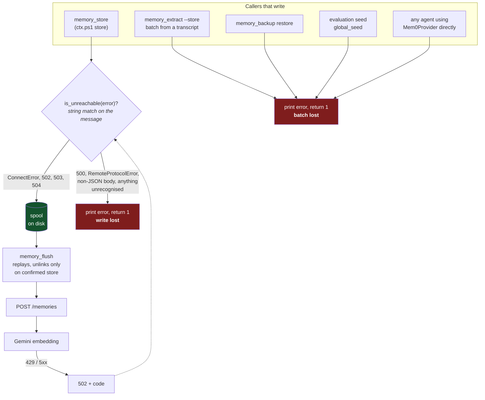
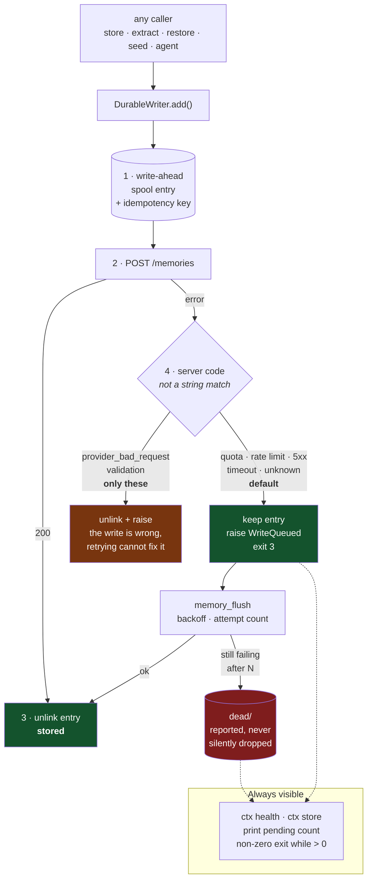

# Not losing a write

*Status: **implemented** (option B), 2026-09-13. The "Today" section below
describes the behaviour this replaced; "Proposed" is what now runs. Verified
end-to-end against the live stack with the Gemini quota genuinely exhausted —
see "What was verified" at the end.*

*One correction to the original proposal: it listed `memory_backup restore` as a
loss case. It is not. Restore reads a backup file that is still on disk, so a
row that fails is re-run, not lost — it is the one writer whose input survives
its own failure, and it stays on the raw provider so a bulk restore cannot bury
the queue under rows that have another copy.*

Reads and writes are not worth the same. A search that fails is retried by the
person who ran it, one second later, at no cost. A write that fails takes an
observation with it — the reason someone made a decision, the failure they just
diagnosed — and nobody notices, because the thing that was lost never existed
anywhere else. **Losing a query is an inconvenience. Losing a write is the
product failing at its one job.**

So the asymmetry is deliberate: reads may fail fast, writes may not fail at all.

## Today: what actually happens

Measured, not assumed. Against the live stack with the Gemini daily quota
genuinely exhausted:

```
$ python -m src.scripts.memory_store --scope task --key quota-probe ...
WARNING: the Mem0 server is unreachable. The memory was NOT stored.
  reason:  Mem0 POST /memories failed [502]: Provider quota exhausted for the day: ...
  queued:  ...\spool\20260913T181133-8fe5d539.json
  pending: 1 write(s) waiting
exit 3
```

So the CLI does queue a quota failure. It does **not** stack up silently, and it
does not throw-and-forget. `memory_flush` then replays, and `Spool.flush` only
calls `path.unlink()` after `provider.add` returns — a failed replay keeps the
file.

That is the good half. The bad half is that this holds for exactly one caller
and one hand-written list of error strings.



Three holes, in order of how much they cost:

1. **The safety net is in the wrong layer.** `Spool` is imported by
   `memory_store.py` and `memory_flush.py` and nothing else. `memory_extract
   --store` writes a whole batch of extracted candidates and, on any failure,
   prints and returns 1 — that is the single largest loss in the system, because
   it is many memories at once and they came from a transcript that may be gone.
   Same for `memory_backup restore`, both seeders, and any agent that constructs
   a `Mem0Provider` itself.

2. **The decision is a string match, and it defaults to losing.**

   ```python
   markers = ("Connection refused", "10061", "Max retries",
              "Failed to establish", "[502]", "[503]", "[504]")
   ```

   A 500 is not in that list. Neither is `httpx.RemoteProtocolError`,
   `httpx.PoolTimeout`, a proxy's HTML error page (which trips the "non-JSON
   body" branch), or a 429 if the server ever stopped wrapping it as a 502. Each
   one is a real embedding failure and each one currently loses the write. The
   default answer to "should this be kept?" is **no**, which is the wrong way
   round: the cost of wrongly queueing is a file a human deletes, and the cost
   of wrongly discarding is an observation nobody can recover.

3. **The client throws away what the server told it.** `errors.py` already
   returns a typed `code` (`provider_quota_exhausted`, `provider_rate_limited`,
   `provider_unavailable`, `provider_bad_request`, …) in the response body.
   `Mem0Provider._request` formats a string and drops the code, so the client
   re-derives intent by grepping the string it just built. That is also why the
   warning above says *"the Mem0 server is unreachable — start the stack"* when
   the server is up and the truth is a spent quota.

There is a fourth, structural: the `memories.vector` column is **nullable**
(`vector | vector(768) | | |`). Nothing at the storage layer prevents a row that
was accepted but never embedded — invisible to every search, indistinguishable
from not existing. No such row exists today (0 of 16), but the guarantee is not
enforced, it is merely holding.

## Proposed

One rule: **the durability boundary moves from the CLI to the provider, and its
default flips to keep.**



What each numbered step buys:

**1 — write ahead, not write behind.** The entry hits disk *before* the request,
so a crash, a `Ctrl+C`, or a killed terminal mid-POST leaves the memory
recoverable. Today the spool is only written in the exception handler, so a
process that dies during the call loses the write with no error at all.

The cost is a new duplicate window: stored server-side, then killed before
`unlink`, and the flush replays it. Paid for with an idempotency key — mem0
already stores a `hash` per memory, so the replay can be made a no-op on an
existing hash. Duplicating a memory is recoverable; losing one is not, so this
trade goes in the right direction.

**4 — an allowlist of failures worth dropping, not an allowlist of failures
worth keeping.** Only a request the server judged *malformed* fails fast,
because that one genuinely cannot succeed on retry. Everything else — including
an error nobody has seen before — is kept. This is the whole inversion: an
unrecognised error must land on the safe side of the default.

The classification comes from the server's `code` field, which already exists
and is already correct. The client stops parsing its own error message.

**The drain needs a floor.** A queue that only grows is a slow leak with extra
steps. `memory_flush` gets backoff and an attempt counter; a write that fails N
times moves to `dead/` and is *reported*, never quietly discarded — a human
decides. And the pending count belongs in `ctx health` and in the tail of every
`ctx store`, with a non-zero exit while anything is queued, so "queued" cannot
be mistaken for "stored" by a script or by a person skimming.

## The three ways to do it

| | Where durability lives | Covers | Cost |
|---|---|---|---|
| **A. Widen the predicate** | `memory_store.py`, as today | The CLI only | Hours. One function, invert its default. |
| **B. Provider-level write-ahead** *(recommended)* | `Mem0Provider` / `DurableWriter` | Every Python caller | A day or two. Touches one class; callers unchanged. |
| **C. Server-side ingest queue** | `POST /memories` accepts, embeds async | Every client, including the dashboard and a future MCP server | Largest. A worker, a job table, and a real fork of upstream's write path. |

**A** is a genuine improvement and is most of the safety for a fraction of the
work — but it leaves `memory_extract --store` losing whole batches, which is the
single worst case in the system. It fixes the predicate and not the layering.

**C** is the only option that also protects a write issued by the dashboard or
by an MCP client that is not Python. But it makes the accepted-but-unembedded
row a normal state rather than an anomaly, which means search results are
silently incomplete for as long as the backlog exists — and the nullable
`vector` column means nothing would catch it. That needs a `pending_embedding`
flag and a way for search to report "N rows not yet searchable" before C is safe
to build. Real, but not first.

**B is the recommendation.** It puts the guarantee at the narrowest point every
Python write already passes through, so `extract`, `restore`, the seeders and any
agent holding a provider all inherit it without changing a line. It subsumes A —
the inverted predicate is part of it — and it does not block C later, because a
server-side queue would sit behind the same provider call.

Suggested order, each independently useful:

1. Provider surfaces the server's `code` as a typed exception. *(Small, and
   immediately fixes the "server is unreachable / start the stack" message that
   is wrong for a quota.)*
2. Invert the predicate: keep by default, drop only on an explicit permanent
   set.
3. Move enqueue into `DurableWriter.add`, write-ahead, with the hash as the
   idempotency key.
4. Flush gets backoff, attempt counts and `dead/`.
5. Pending count in `ctx health` and after every store; non-zero exit while the
   queue is not empty.

Steps 1 and 2 alone close every case in hole 2 above, and can ship on their own.

## What to verify, and how it should fail

A durability mechanism that is not tested against its own failure is decoration.
Each of these has to be exercised deliberately, because all of them are silent:

- **Server up, embedder failing** — the case that started this. Already
  reproducible for free while the quota is spent; after it resets, point the
  container at a bad `GOOGLE_API_KEY`.
- **Killed mid-write** — `Ctrl+C` during the POST. Today: lost. After (1)–(3):
  present in the spool.
- **Stored, then killed before unlink** — the duplicate window. Must replay to a
  no-op, not to a second copy.
- **A genuinely bad write** (empty text, unknown scope) — must *not* queue, and
  must not sit in `dead/` pretending to be a transient failure.
- **A flush that partially succeeds** — 3 of 5 replayed must exit non-zero and
  say `2 of 5 still queued`, never "flushed".

The property under test is always the same one, and it is not "did it store":
it is **no write disappears without a human being told**.

## Server-side queue (option C), implemented 2026-09-13

The client spool stays - it is the only thing that survives "cannot reach the
server at all". What moved server-side is the *other* job it was doing badly:
holding a write because the **embedder** failed. That failure is server-wide, so
one person's laptop was the wrong place for it. It was invisible to everyone
else, drained only when that person ran a command, and each client retried
independently against the same shared quota.

```
ANY client (ctx · agent · dashboard · MCP)
   |
   [WAL] client spool          now covers ONE case: "could not hand it over"
   |
   v  POST /memories  (+ Idempotency-Key)
   |
   +-- key already queued or stored? --> 202 duplicate, client deletes its entry
   |
   v
 TRY INLINE EMBED  .......... happy path unchanged: still 200 + records
   |
   +-- embed OK ---> INSERT memories(vector, payload) --------------> 200
   |
   +-- embed FAILS, and the code is queueable
          |
          v
   INSERT pending_memories(state='pending')   <-- durable here
          |
          v
        202 Accepted ---> client deletes its spool entry. Client is done.

   worker (in-process, started with the app)
      TRIGGERS: on enqueue · on startup · on the backoff timer · on any success
      |
      claim ---> embed ---> insert into the vector store ---> delete the row
        |          |
        |          +-- fail: state='error', attempts+1, next_attempt_at
        |                    attempts >= 12 --> state='dead' (never deleted)
        |
        +-- claim is: UPDATE ... WHERE id IN (
                        SELECT id ... FOR UPDATE SKIP LOCKED LIMIT n)
            plus lease_until, so a worker that dies releases its rows
```

**Inline first** is why nothing broke: a caller that never sees a failure never
sees a difference. The 502 became a 202.

### pending vs error

Two states, because they mean different things and only one is worth re-arming.
`pending` is "nobody has tried yet". `error` is "the provider refused". When any
embedding succeeds, every `error` row is swept back to `pending` and its backoff
discarded - that success is fresh evidence the outage is over, and the delays
were guesses about a condition that has since changed. `dead` rows are left
alone: they failed for a reason a working provider does not explain.

### Not processing the same embedding twice

Three different collisions, three answers:

| Collision | Answer |
|---|---|
| Two workers, one row | `FOR UPDATE SKIP LOCKED` + `lease_until`. Verified: two concurrent claimers split 4 rows 1/3 with **zero overlap**. |
| A worker dies holding rows | Lease expiry makes them claimable again. Verified: re-claimable after the lease, not before. |
| Two users, identical text | `content_hash` (the same md5 mem0 stores) serves the vector from an existing row instead of calling the provider. Only for `memory_action="add"` - Gemini embeds per task type, so reusing a "search" vector for "add" would quietly degrade ranking. |
| The same request twice | `idempotency_key` is `UNIQUE`; a retry returns the same `pending_id` with `duplicate: true`. |

### Circuit breaker

A queue of N rows must not discover one outage N times. On the free tier that is
not a nicety: 1,000 embeddings a day, and letting each row find out for itself
that the quota is gone spends the next day's allowance on failures, so the queue
would guarantee it could never drain.

So a provider-wide failure parks the whole queue and one probe is let through
when the window opens. A daily quota waits an hour, not the `retryDelay: 2s`
Google returns even on a daily exhaustion. A malformed row does **not** trip it -
that is one row's problem.

Note the default is deliberately the **opposite** of the client spool's. There,
an unrecognised error must *keep* the write, because being wrong costs a memory.
Here, an unrecognised error must *not* park the queue, because being wrong costs
every other row a stall - and those rows are already safe on disk. Same
principle, different cheap direction.

The breaker is in-memory, so a restart forgets it. That is survivable rather
than ideal: each row's own `next_attempt_at` is in the database, so a fresh
breaker cannot cause a retry storm - it costs at most one probe per restart.

### Where to see it

`/dashboard/queue` in the sidebar: counts by state, the parked banner with its
next probe time, per-row attempts and last error, "retry all now", and discard.
`ctx health` prints the same counts and **exits non-zero while anything is
unsearchable** - a green health check with an incomplete store is the exact
reassuring-but-wrong answer this layer exists to prevent.

### What this deliberately does not do

An unembedded memory is **not** in the vector table at all - it lives in
`pending_memories`. That was the objection to server-side queueing in the first
place: a null-vector row in `memories` would be a memory that exists but cannot
be found, and the column is nullable so nothing would catch it. Keeping them
apart makes an unembedded memory structurally invisible to search rather than
invisibly missing from it, and the count is reported as `not_searchable`.

Ordering is not preserved: batched claims mean B can become searchable before A.

## What was verified

Against the running stack, with the Gemini daily quota genuinely exhausted, so
the failure is real rather than simulated:

| Step | Result |
|---|---|
| `memory_store` while the embedder 429s | exit 3, entry on disk, advice names the quota — not "start the stack" |
| `memory_flush` | `0 of 1 replayed, 1 failed and still queued`, attempt counted, exit 1 |
| `memory_flush` again, immediately | `1 waiting on backoff … eligible at 18:38:00Z`, attempt **not** burned |
| `memory_flush --force` | retried at once, attempt 2 |
| `--max-attempts 3`, third failure | moved to `dead/`, file still present with its text and last error |
| `memory_flush --list` | shows `[1 failed attempt(s)]` per entry |

320 tests, including 28 new ones in `tests/context_memory/test_durable.py`.
Verified red: restoring the old string-matching predicate fails 13 of them,
among them all nine error types that were previously discarded.

Not verified live, and honestly so: **a queued write replaying to success.**
That needs one working embedding call and the quota is spent, so the success
path is covered only by the unit tests with a fake provider. It should be re-run
after the quota resets — the command is `memory_flush --force`, and the check is
that the spool empties and the memory is searchable.

`scripts/test-offline-spool.ps1` reports **13 of 23** for the same reason: its
phase 1 (queueing, isolation, multi-user, multi-repo) passes in full, and every
one of the 10 failures is in the replay phase, which cannot store anything until
the quota resets. Reproduced directly to confirm rather than inferred: a
one-entry spool replayed against the live server returns the same
`502 … embed_content_free_tier_requests, limit 1000`.
